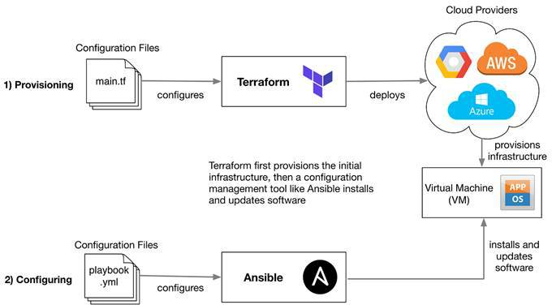
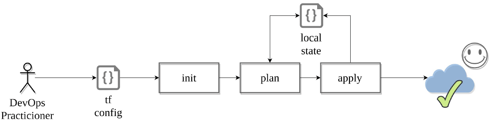

# Terraform Orchestration
- [Terraform Orchestration](#terraform-orchestration)
    - [What is Terraform?](#what-is-terraform)
    - [Why Terraform?](#why-terraform)
    - [Terraform commands](#terraform-commands)
      - [`terraform init`](#terraform-init)
      - [`terraform plan`](#terraform-plan)
      - [`terraform apply`](#terraform-apply)
      - [`terraform destroy`](#terraform-destroy)
    - [Setting up Terraform](#setting-up-terraform)
      - [Securing AWS keys for Terraform](#securing-aws-keys-for-terraform)
    - [Creating Resources on AWS](#creating-resources-on-aws)
- [Method 1 - Using variables.tf file and main.tf](#method-1---using-variablestf-file-and-maintf)
  - [Create a VPC](#create-a-vpc)
    - [Create a vpc with your CDIR block](#create-a-vpc-with-your-cdir-block)
    - [Create a public subnet using your VPC ID](#create-a-public-subnet-using-your-vpc-id)
    - [Create an internet gateway using your VPC ID](#create-an-internet-gateway-using-your-vpc-id)
  - [Data](#data)
    - [Create a new route table, attach using internet gateway](#create-a-new-route-table-attach-using-internet-gateway)
    - [Grab a reference to the internet gateway for our VPC](#grab-a-reference-to-the-internet-gateway-for-our-vpc)
    - [Creating a Security Group attached to your VPC](#creating-a-security-group-attached-to-your-vpc)
    - [Create an EC2 instance for your app](#create-an-ec2-instance-for-your-app)
  - [For your DB:](#for-your-db)
    - [Create a private subnet](#create-a-private-subnet)
    - [Create a db security group attached to the VPC](#create-a-db-security-group-attached-to-the-vpc)
    - [Creating a db instance](#creating-a-db-instance)
- [Method 2 - Outputs as Inputs](#method-2---outputs-as-inputs)
  - [main.tf using method 2](#maintf-using-method-2)
  - [Create CloudWatch for you app -Monitoring-Load Balancer - Application ALB - Network Load Balancer - together Autoscaling group](#create-cloudwatch-for-you-app--monitoring-load-balancer---application-alb---network-load-balancer---together-autoscaling-group)
    - [Step 1: Create a launch template](#step-1-create-a-launch-template)
    - [Step 2: Application Load Balancer](#step-2-application-load-balancer)
    - [Step 3: Target group](#step-3-target-group)
    - [Step 4: Listener](#step-4-listener)
    - [Step 5: Create Auto Scaling Group from your launch template](#step-5-create-auto-scaling-group-from-your-launch-template)
- [Auto Scaling Policies](#auto-scaling-policies)
  - [CPU Scale Out](#cpu-scale-out)
  - [CPU Scale In](#cpu-scale-in)
  - [Alarm for CPU Scale In](#alarm-for-cpu-scale-in)
  - [Network In - Scale Out Policy](#network-in---scale-out-policy)
  - [Network In - Scale In Policy](#network-in---scale-in-policy)
  - [Alarm for Network In - Scale In Policy](#alarm-for-network-in---scale-in-policy)


### What is Terraform?
- Open-source infrastructure as code software tool that provides a consistent Command Line Interface (CLI) workflow to manage hundreds of cloud services.

### Why Terraform?
### Terraform commands

#### `terraform init`
- Initialises a working directory containing Terraform configuration files
- The first command that should be run after writing a new Terraform configuration or cloning an existing one from version control.
- It is safe to run this command multiple times.

#### `terraform plan`
- Creates an execution plan
- Comparing the current configuration to the prior state and noting any differences.
#### `terraform apply`
- Executes the actions proposed in a Terraform plan

#### `terraform destroy`
- Destroys all remote objects managed by a particular Terraform configuration
- terraform apply -destroy

### Setting up Terraform
#### Securing AWS keys for Terraform
- Create env var to secure AWS keys
    - In Windows, `Edit the system environment variables` -> `Advanced` -> `Environment Variables...` -> Under `User variables for Sacha`, click `New...`
    - Variable Name: AWS_ACCESS_KEY_ID -> Variable Value: (copy value from excel file)
    - Variable Name: AWS_SECRET_ACCESS_KEY -> Variable Value: (copy value from excel file)
- Restart the terminal
- Create a file called main.tf
- add the code to initialise terrafrom with provider AWS

```
provider "aws" {
    region = "eu-west-1"

}
```

- Let's run this code with `terraform init` 
### Creating Resources on AWS
- Let's start with Launching the EC2 instance using the app AMI
    - define the resource name
    - ami id
    - `sre_key.pem` file
    - AWS keys set is already done (changed in environment variables)
    - public ip
    - type of the instance `t2micro` 

```
resource "aws_instance" "app_instance" {
  ami = "ami-00e8ddf087865b27f"
  instance_type = "t2.micro"
  associate_public_ip_address = true
  tags = {
      Name = "sre_sacha_terraform_app"
  }
}
```

- `terraform plan`
- `terraform apply` -> `yes`

- Instance should be running

- `terraform destroy` to delete instance you have created

# Method 1 - Using variables.tf file and main.tf
## Create a VPC


- delete your customised VPC and resources created inside the VPC
- then create a VPC with Terraform

- See [Networking documentation](https://github.com/sachadorf1/SRE_AWS_VPC_Networking) repo for setting up a VPC on AWS. We are using the same method but using Terraform.

### Create a vpc with your CDIR block
- Create variable.tf folder - This is where you can define variables for your vpc id, subnet id, security groups etc so you can use the variable names in your main.tf file, rather than the actual ids
- In your main.tf folder, enter the following using your own CIDR block (e.g. 10.106.0.0/16):
```
resource "aws_vpc" "main" {
  cidr_block       = "10.106.0.0/16"
  instance_tenancy = "default"

  tags = {
    Name = "main"
  }
}  
```
- Run `terraform plan`
- Run `terraform apply`

- get the VPC ID from aws or terraform logs
- add the VPC ID to your variable.tf file e.g.
```
variable "vpc_id" {
  default = "vpc-0ca8e735b4084d9cc"
}
```
- Now you can write var.vpc_id to get the id of your vpc

- Also add vpc_cidr (e.g. 10.106.0.0/16), public_subnet_cidr (e.g. 10.106.1.0/24), ami_app_id (Use the ami you previously created for your app), aws_key_name, aws_key_path to the variable.tf file in the same way as you did with the vpc_id
```
variable "aws_key_name" {
    default = "sre_key"
}
```
```
variable "aws_key_path" {
    default = "~/.ssh/sre_key.pem"
}
```
### Create a public subnet using your VPC ID
- Add the following to your main.tf file:
```
resource "aws_subnet" "sre_sacha_subnet_public" {
  vpc_id     = var.vpc_id
  cidr_block = var.public_subnet_cidr
  map_public_ip_on_launch = "true"  # Makes this a public subnet
  availability_zone = "eu-west-1a"

  tags = {
    Name = "sre_sacha_subnet_public"
  }
}
```

- Add subnet_public_id to variable.tf

### Create an internet gateway using your VPC ID
- Add the following to your main.tf file:
```
resource "aws_internet_gateway" "sre_sacha_terraform_ig" {
  vpc_id = var.vpc_id
  tags = {
    Name = "sre_sacha_terraform_ig"
  }
}
```
- Add internet_gateway_id to variable.tf file

## Data

Now we're building quickly. Let's add a few more parts of our architecture. For example, our subnet is currently using the default route table which is private. Let's create a new route table and associate it with our public subnet.


> EXERCISE ( 5 Minutes ) : Find the resource needed to create a route table.

### Create a new route table, attach using internet gateway
- Add the following to your main.tf file:
```
resource "aws_route_table" "sre_sacha_rt-public" {
vpc_id = var.vpc_id
route {
cidr_block = "0.0.0.0/0"
gateway_id = var.internet_gateway_id
}
tags = {
Name = "sre_sacha_rt-public"
}
}
```
- Add def_route_table_id to variable.tf file
### Grab a reference to the internet gateway for our VPC
- Add the following to your main.tf file:
```
data
 "aws_internet_gateway" "default" {
filter {
name = "attachment.vpc-id"
values = ["${var.vpc_id}"]
}
}
```
### Creating a Security Group attached to your VPC
- Add the following to your main.tf file, making sure to enter you ip address for port 22 access:

```
resource "aws_security_group" "sr_sacha_app_group"  {
  name = "sre_sacha_app_sg_terraform"
  description = "sre_sacha_app_sg_terraform"
  vpc_id = var.vpc_id # attaching the SG with your own VPC
  ingress {
    from_port       = "80"
    to_port         = "80"
    protocol        = "tcp"
    cidr_blocks     = ["0.0.0.0/0"]   
  }
  ingress {
    from_port       = "22"
    to_port         = "22"
    protocol        = "tcp"
    cidr_blocks     = ["enter you ip address here"]  
  }
    ingress {
    from_port       = "3000"
    to_port         = "3000"
    protocol        = "tcp"
    cidr_blocks     = ["0.0.0.0/0"]  
  }
  egress {
    from_port       = 0
    to_port         = 0
    protocol        = "-1" # allow all
    cidr_blocks     = ["0.0.0.0/0"]
  }

  tags = {
    Name = "sre_sacha_app_sg_terraform"
  }
}
```
- Add security_group_id to variable.tf file 

### Create an EC2 instance for your app
- Add the following to your main.tf file:
```
resource "aws_instance" "sre_sacha_terraform_app" {
  ami =  var.ami_id
  subnet_id = var.subnet_public_id
  vpc_security_group_ids = [var.security_group_id]
  instance_type = "t2.micro"
  associate_public_ip_address = true
  key_name = var.aws_key_name
  connection {
		type = "ssh"
		user = "ubuntu"
		private_key = var.aws_key_path
		host = "${self.associate_public_ip_address}"
	} 
  tags = {
      Name = "sre_sacha_terraform_app"
  }
}
```
- You should see your app instance in AWS
## For your DB:
- Same vpc_id
- Create a private subnet with private subnet CIDR
- In variable.tf
    - Add the ami_db_id (Use the ami you created previously for your db)
    - Add the private_subnet_cidr (e.g. 10.106.2.0/24)
### Create a private subnet
- Add the following to your main.tf file:
```
resource "aws_subnet" "sre_sacha_subnet_private" {
  vpc_id     = var.vpc_id
  cidr_block = var.private_subnet_cidr
  map_public_ip_on_launch = "false"  # Makes this a public subnet
  availability_zone = "eu-west-1a"

  tags = {
    Name = "sre_sacha_subnet_private"
  }
}
```
- `terraform plan`
- `terraform apply`
- Add subnet_private_id to variable.tf

### Create a db security group attached to the VPC
- Add the following to your main.tf file:
- Use the app ip from 
```
resource "aws_security_group" "sr_sacha_db_group"  {
  name = "sre_sacha_db_sg_terraform"
  description = "sre_sacha_db_sg_terraform"
  vpc_id = var.vpc_id # attaching the SG with your own VPC
  ingress {
    from_port       = "27017"
    to_port         = "27107"
    protocol        = "tcp"
    cidr_blocks     = ["Enter your app ip here"]   
  }
  ingress {
    from_port       = "22"
    to_port         = "22"
    protocol        = "tcp"
    cidr_blocks     = ["Enter your ip here"]  
  }
  egress {
    from_port       = 0
    to_port         = 0
    protocol        = "-1" # allow all
    cidr_blocks     = ["0.0.0.0/0"]
  }

  tags = {
    Name = "sre_sacha_db_sg_terraform"
  }
}
```
- Add security_group_db_id to the variable.tf file
- `terraform plan`
- `terraform apply`
### Creating a db instance

```
resource "aws_instance" "sre_sacha_terraform_db" {
  ami =  var.ami_db_id
  subnet_id = var.subnet_private_id
  vpc_security_group_ids = [var.security_group_db_id]
  instance_type = "t2.micro"
  associate_public_ip_address = true
  key_name = var.aws_key_name
  connection {
		type = "ssh"
		user = "ubuntu"
		private_key = var.aws_key_path
		host = "${self.associate_public_ip_address}"
        # host = aws_instance.app_instance.public_ip
	} 
  tags = {
      Name = "sre_sacha_terraform_db"
  }
}
```
- `terraform plan`
- `terraform apply`
- You should see your db instance in AWS (and be able to ssh into it if you have given yourself port 22 access)

# Method 2 - Outputs as Inputs
- Outputs documentation https://www.terraform.io/docs/language/values/outputs.html

Instead of manually inputting the ids into the variable.tf file and having to run the main.tf file one block at a time, we can use another format:

id_of_resource = <'resource_type'><'resource_name'>.id
e.g.
```
# vpc
resource "aws_vpc" "sre_sacha_vpc" {
  cidr_block       = var.vpc_cidr
  instance_tenancy = "default"

  tags = {
    Name = "sre_sacha_vpc"
  }
}  

# public subnet
resource "aws_subnet" "sre_sacha_subnet_public" {
  vpc_id     = aws_vpc.sre_sacha_vpc.id
  cidr_block = var.public_subnet_cidr
  map_public_ip_on_launch = "true"  # Makes this a public subnet
  availability_zone = "eu-west-1a"

  tags = {
    Name = "sre_sacha_subnet_public"
  }
}
```
In this line, aws_vpc is the resource type and sre_sacha_vpc is the resource name:
```
vpc_id     = aws_vpc.sre_sacha_vpc.id
```
## main.tf using method 2

```
# Let's set up our cloud provider with Terraform
provider "aws" {
    region = "eu-west-1"

}

# vpc
resource "aws_vpc" "sre_sacha_vpc" {
  cidr_block       = var.vpc_cidr
  instance_tenancy = "default"

  tags = {
    Name = "sre_sacha_vpc"
  }
}  

# Creating a public subnet inside the VPC
resource "aws_subnet" "sre_sacha_subnet_public" {
  vpc_id     = aws_vpc.sre_sacha_vpc.id
  cidr_block = var.public_subnet_cidr
  map_public_ip_on_launch = "true"  # Makes this a public subnet
  availability_zone = "eu-west-1a"

  tags = {
    Name = "sre_sacha_subnet_public"
  }
}

# Creating a private subnet inside the VPC
resource "aws_subnet" "sre_sacha_subnet_private" {
  vpc_id     = aws_vpc.sre_sacha_vpc.id
  cidr_block = var.private_subnet_cidr
  map_public_ip_on_launch = "false"  # Makes this a private subnet
  availability_zone = "eu-west-1a"

  tags = {
    Name = "sre_sacha_subnet_private"
  }
}

# Creating a new internet gateway attached to the VPC
resource "aws_internet_gateway" "sre_sacha_terraform_ig" {
  vpc_id = aws_vpc.sre_sacha_vpc.id
  tags = {
    Name = "sre_sacha_terraform_ig"
  }
}

resource "aws_route" "sre_sacha_route_ig_connection" {
    route_table_id = aws_vpc.sre_sacha_vpc.default_route_table_id
    destination_cidr_block = "0.0.0.0/0"
    gateway_id = aws_internet_gateway.sre_sacha_terraform_ig.id
}

# Creating an app Security Group attached to VPC
resource "aws_security_group" "sr_sacha_app_group"  {
  name = "sre_sacha_app_sg_terraform"
  description = "sre_sacha_app_sg_terraform"
  vpc_id = aws_vpc.sre_sacha_vpc.id # attaching the SG with your own VPC
  ingress {
    from_port       = "80"
    to_port         = "80"
    protocol        = "tcp"
    cidr_blocks     = ["0.0.0.0/0"]   
  }
  ingress {
    from_port       = "22"
    to_port         = "22"
    protocol        = "tcp"
    cidr_blocks     = ["${var.myip}"]  
  }
    ingress {
    from_port       = "3000"
    to_port         = "3000"
    protocol        = "tcp"
    cidr_blocks     = ["0.0.0.0/0"]  
  }
  egress {
    from_port       = 0
    to_port         = 0
    protocol        = "-1" # allow all
    cidr_blocks     = ["0.0.0.0/0"]
  }

  tags = {
    Name = "sre_sacha_app_sg_terraform"
  }
}

# Creating an app instance, using VPC, public subnet and app security group
resource "aws_instance" "sre_sacha_terraform_app" {
  ami =  var.ami_app_id
  subnet_id = aws_subnet.sre_sacha_subnet_public.id
  vpc_security_group_ids = [aws_security_group.sr_sacha_app_group.id]
  instance_type = "t2.micro"
  associate_public_ip_address = true
  key_name = var.aws_key_name
  connection {
		type = "ssh"
		user = "ubuntu"
		private_key = var.aws_key_path
		host = "${self.associate_public_ip_address}"
        # host = aws_instance.app_instance.public_ip
	} 
  tags = {
      Name = "sre_sacha_terraform_app"
  }
}

# Creating a db Security Group with port access for the app ip, attached to VPC
resource "aws_security_group" "sr_sacha_db_group"  {
  name = "sre_sacha_db_sg_terraform"
  description = "sre_sacha_db_sg_terraform"
  vpc_id = aws_vpc.sre_sacha_vpc.id # attaching the SG with your own VPC
  ingress {
    from_port       = "27017"
    to_port         = "27107"
    protocol        = "tcp"
    cidr_blocks     = ["${aws_instance.sre_sacha_terraform_app.public_ip}/32"]   
  }
  ingress {
    from_port       = "22"
    to_port         = "22"
    protocol        = "tcp"
    cidr_blocks     = ["${var.myip}"]  
  }
  
  egress {
    from_port       = 0
    to_port         = 0
    protocol        = "-1" # allow all
    cidr_blocks     = ["0.0.0.0/0"]
  }

  tags = {
    Name = "sre_sacha_db_sg_terraform"
  }
}

resource "aws_instance" "sre_sacha_terraform_db" {
  ami =  var.ami_db_id
  subnet_id = aws_subnet.sre_sacha_subnet_private.id
  vpc_security_group_ids = [aws_security_group.sr_sacha_db_group.id]
  instance_type = "t2.micro"
  associate_public_ip_address = true
  key_name = var.aws_key_name
  connection {
		type = "ssh"
		user = "ubuntu"
		private_key = var.aws_key_path
		host = "${self.associate_public_ip_address}"
        # host = aws_instance.app_instance.public_ip
	} 
  tags = {
      Name = "sre_sacha_terraform_db"
  }
}
```

## Create CloudWatch for you app -Monitoring-Load Balancer - Application ALB - Network Load Balancer - together Autoscaling group
See my [SRE_Monitoring Repo](https://github.com/sachadorf1/SRE_Monitoring) for step by step via AWS
### Step 1: Create a launch template
```
resource "aws_launch_template" "sre_sacha_launch_template_terraform" {
  name = "sre_sacha_launch_template_terraform"
  description = "sre_sacha_launch_template_terraform"

  image_id = var.ami_app_id

  instance_type = "t2.micro"

  key_name = var.aws_key_name

  vpc_security_group_ids = [aws_security_group.sr_sacha_app_group.id]
  tags = {
      Name = "sre_sacha_launch_template_terraform"
  }
}
```
### Step 2: Application Load Balancer
```
resource "aws_lb" "sre-sacha-lb-terraform" {
  name               = "sre-sacha-lb-terraform"
  internal           = false
  load_balancer_type = "application"
  security_groups    = [aws_security_group.sr_sacha_app_group.id]
  subnets            = [aws_subnet.sre_sacha_subnet_public1.id, aws_subnet.sre_sacha_subnet_public2.id]

  # enable_deletion_protection = true

  tags = {
    Name = "sre-sacha-lb-terraform"
  }
}
```
### Step 3: Target group
```
resource "aws_lb_target_group" "sre-sacha-lb-target-group-tf" {
  name     = "sre-sacha-lb-target-group-tf"
  port     = 80
  protocol = "HTTP"
  vpc_id   = aws_vpc.sre_sacha_vpc.id
  
  tags = {
    Name = "sre-sacha-lb-target-group-tf"
  }
}
```
### Step 4: Listener
```
resource "aws_lb_listener" "sre_sacha_lb_listener_terraform" {
  load_balancer_arn = aws_lb.sre-sacha-lb-terraform.arn
  port              = "80"
  protocol          = "HTTP"

  default_action {
    type             = "forward"
    target_group_arn = aws_lb_target_group.sre-sacha-lb-target-group-tf.arn
  }
}
```
### Step 5: Create Auto Scaling Group from your launch template
```
resource "aws_autoscaling_group" "sre_sacha_autoscale_terraform" {
  name = "sre_sacha_autoscale_terraform"
  vpc_zone_identifier = [aws_subnet.sre_sacha_subnet_public1.id, aws_subnet.sre_sacha_subnet_public2.id]
  desired_capacity   = 1
  max_size           = 3
  min_size           = 1

  launch_template {
    id      = aws_launch_template.sre_sacha_launch_template_terraform.id
    version = "$Latest"
  }
}
```
# Auto Scaling Policies
## CPU Scale Out
```
resource "aws_autoscaling_policy" "sre_sacha_scale_out_CPU_policy_terraform" {
  name = "sre_sacha_scale_out_CPU_policy_terraform"
  policy_type = "TargetTrackingScaling"
  estimated_instance_warmup = 100
  autoscaling_group_name = aws_autoscaling_group.sre_sacha_autoscale_terraform.name
  target_tracking_configuration {
      predefined_metric_specification {
          predefined_metric_type = "ASGAverageCPUUtilization"
      }
      target_value = 50.0
  }
}
```
## CPU Scale In
```
resource "aws_autoscaling_policy" "sre_sacha_scale_in_CPU_policy" {
  name                   = "sre_sacha_scale_in_CPU_policy"
  scaling_adjustment     = -1
  adjustment_type        = "ChangeInCapacity"
  cooldown               = 300
  autoscaling_group_name = aws_autoscaling_group.sre_sacha_autoscale_terraform.name
}
```
## Alarm for CPU Scale In
```
resource "aws_cloudwatch_metric_alarm" "SRE_sacha_CPU_scale_in_alarm" {
  alarm_name          = "SRE_sacha_CPU_scale_in_alarm"
  comparison_operator = "LessThanThreshold"
  evaluation_periods  = "2"
  metric_name         = "CPUUtilization"
  namespace           = "AWS/EC2"
  period              = "120"
  statistic           = "Average"
  threshold           = "50"

  dimensions = {
    AutoScalingGroupName = aws_autoscaling_group.sre_sacha_autoscale_terraform.name
  }

  alarm_description = "This metric monitors ec2 cpu utilization"
  alarm_actions     = [aws_autoscaling_policy.sre_sacha_scale_in_CPU_policy.arn]
}
```
## Network In - Scale Out Policy
```
resource "aws_autoscaling_policy" "sre_sacha_scale_out_Network_In_policy" {
  name = "sre_sacha_scale_out_Network_In_policy"
  policy_type = "TargetTrackingScaling"
  estimated_instance_warmup = 100
  autoscaling_group_name = aws_autoscaling_group.sre_sacha_autoscale_terraform.name
  target_tracking_configuration {
      predefined_metric_specification {
          predefined_metric_type = "ASGAverageNetworkIn"
      }
      target_value = 1000000
  }
}
```
## Network In - Scale In Policy
```
resource "aws_autoscaling_policy" "sre_sacha_scale_in_Network_In_policy" {
  name                   = "sre_sacha_scale_in_Network_In_policy"
  scaling_adjustment     = -1
  adjustment_type        = "ChangeInCapacity"
  cooldown               = 300
  autoscaling_group_name = aws_autoscaling_group.sre_sacha_autoscale_terraform.name
}
```
## Alarm for Network In - Scale In Policy
```
resource "aws_cloudwatch_metric_alarm" "SRE_sacha_Network_In_scale_in_alarm" {
  alarm_name          = "SRE_sacha_Network_In_scale_in_alarm"
  comparison_operator = "LessThanThreshold"
  evaluation_periods  = "2"
  metric_name         = "ASGAverageNetworkIn"
  namespace           = "AWS/EC2"
  period              = "120"
  statistic           = "Average"
  threshold           = "1000000"

  dimensions = {
    AutoScalingGroupName = aws_autoscaling_group.sre_sacha_autoscale_terraform.name
  }

  alarm_description = "This metric monitors ec2 Total Network In"
  alarm_actions     = [aws_autoscaling_policy.sre_sacha_scale_in_Network_In_policy.arn]
}
```